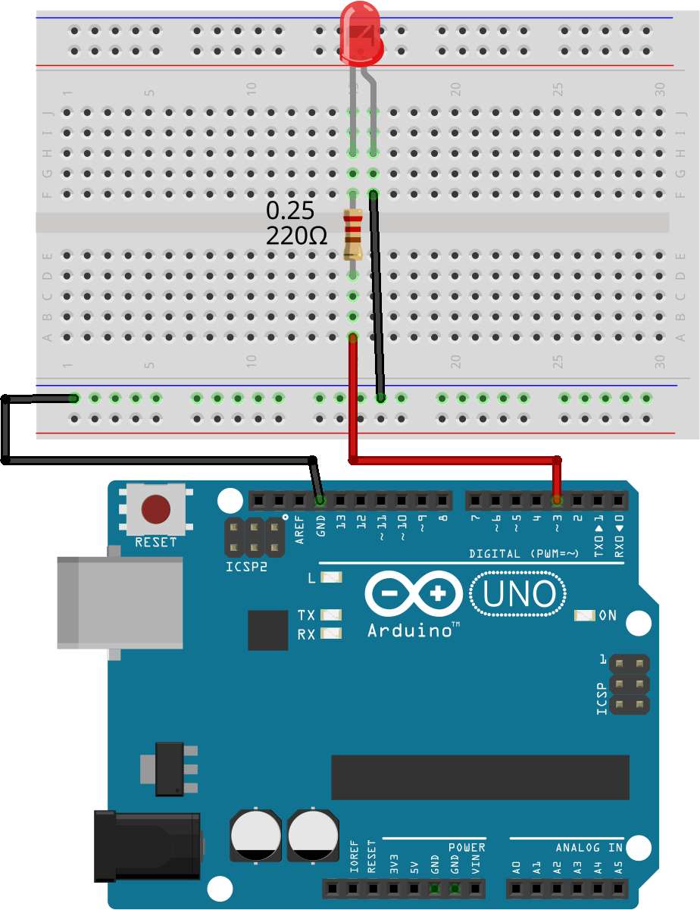

## This page contains a reference of several different kinds of circuits. You can combine one or more of them to make a more complex circuit.

### Button

### Buzzer/Piezo

### LED

### LED (RGB)

### Ultrasonic Sensor

