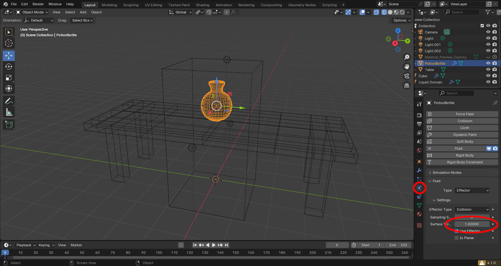
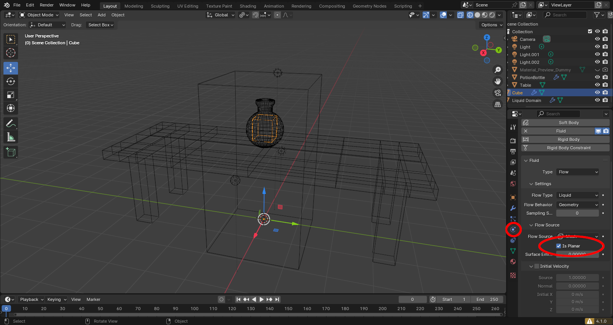
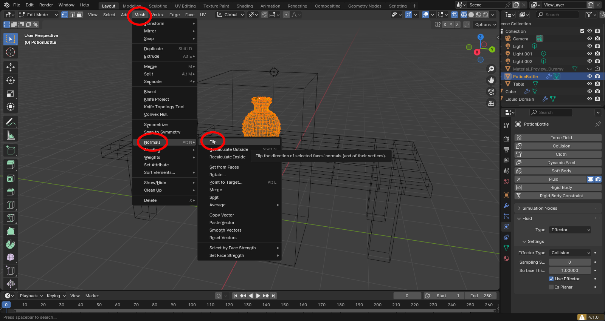
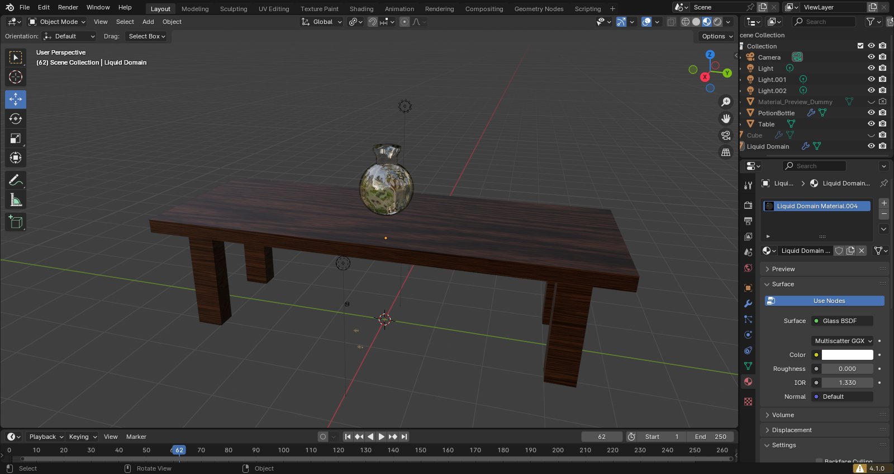

# Liquid Fix
The main problem with this file is that the surface thickness of the potion bottle is too high! To fix it, turn down the surface thickness to a smaller number (I had the best luck with 1.0)

Then, go to the fluid source (the cube) and turn on the "Is Planar" setting. My liquid file works fine without this setting, and I'm not sure why this project needs it. It does fix the liquid simulation, though!

It should work, but your liquid might be acting strangely. That has to do with the normals of the mesh, which we didn't cover in class! In Blender, every face has a front side and a back side, and the front side is called a "normal". Physics work best when they collide with the normal, but the normals of the potion bottle are on the outside! The easiest way to fix that is to go into edit mode, select everything, and then go to Mesh->Normals->Flip

Ta-dah! Liquid!

Some other tips for this model:
- There are a few little droplets that slip out of the bottle. Those are the corners of the cube! You can fix this by either making the cube smaller or using a different object (like a sphere) as the flow source. 
- If you'd like your bottle to be thicker, the easiest way would be to make a smaller sphere inside the bottle (flip the normals) that's the real effector, and disable the effector on the bottle! That will thicken the glass without causing trouble with the physics simulation.
- There's a small ring of vertices on the inside of the bottle that aren't connected to anything. Some of the water seems to be getting caught on those, so deleting them might improve the simulation quality! Make sure you're in vertex select in edit mode or you won't be able to see them.  
