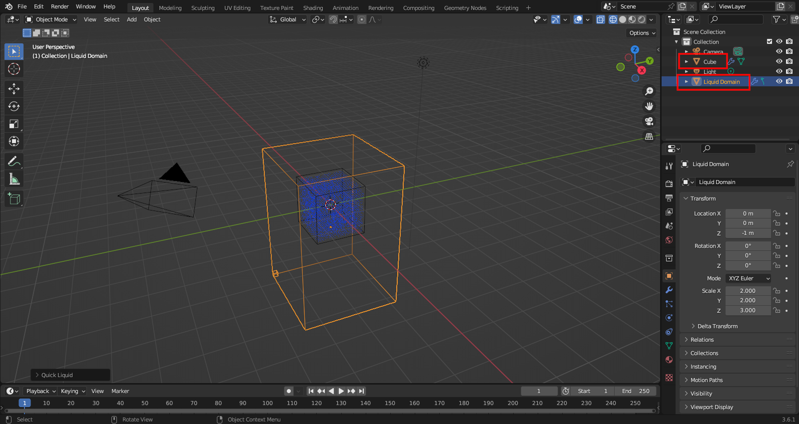

## Blender Liquid Tutorial
To easily make water in Blender, first open a **new file**. Then, in object mode, select the default cube and navigate to **Object > Quick Effects > Quick Liquid**.

This will make two objects: the **Cube** (the liquid source) and the **Liquid Domain** (the liquid container)

To make it look like water, switch to **Material Preview** mode in the top right corner (keyboard shortcut: Z). Then, navigate to the **Physics** tab of the Liquid Domain and select the **Mesh** checkbox.

To see your water, press the **play button** on the Timeline at the bottom of the screen! It may take a bit to load.

Try playing with the values in **Settings** and **Liquid** (in the Physics tab) to change the behavior of the liquid, such as how realistic it is, how quickly it moves, and how thick it is.

You can also change the size and shape of the Cube and Liquid Domain to get different effects. Here's the same Cube with a larger Domain (the same amount of water in a larger container), and the same Domain with a larger Cube (more water in the same size container)

Have fun playing with your 3D liquid simulation!
